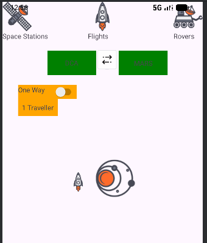

# 实验报告：xml方式的布局

## 实验名称

使用xml方式实现线性布局，表格布局，约束布局

## 实验日期

2025/9/28

## 实验人员

学号133

## 一、实验目的

体验并掌握各种基础布局的使用

---

## 二、实验环境

| 环境项 | 配置信息 |
|--------|----------|
| 操作系统 | Windows 11 |
| 开发工具 | Android Studio [2025.1] |
| JDK版本 | OpenJDK [21] |

---

## 三、实验步骤

### 3.1 线性布局

先使用了一个垂直线性布局
然后在每一行使用一个水平线性布局

主要代码：

```
<LinearLayout
    xmlns:android="http://schemas.android.com/apk/res/android"
    android:layout_width="match_parent"
    android:layout_height="match_parent"
    android:orientation="vertical"
    android:padding="16dp">
    <LinearLayout
        android:layout_width="match_parent"
        android:layout_height="wrap_content"
        android:orientation="horizontal">
        <TextView
            android:layout_width="0dp"
            android:layout_height="wrap_content"
            android:layout_weight="1"
            android:gravity="center"
            android:text="One,One"
            android:textSize="18sp" />
        <TextView
            android:layout_width="0dp"
            android:layout_height="wrap_content"
            android:layout_weight="1"
            android:gravity="center"
            android:text="One,Two"
            android:textSize="18sp" />
        <TextView
            android:layout_width="0dp"
            android:layout_height="wrap_content"
            android:layout_weight="1"
            android:gravity="center"
            android:text="One,Three"
            android:textSize="18sp" />
        <TextView
            android:layout_width="0dp"
            android:layout_height="wrap_content"
            android:layout_weight="1"
            android:gravity="center"
            android:text="One,Four"
            android:textSize="18sp" />
    </LinearLayout> 
```


### 3.2 表格布局

TableLayout 属性：
android:stretchColumns="0"：指定第 0 列（菜单项文本列）自动拉伸，确保文本占满左侧空间，快捷键列（第 1 列）宽度自适应。

TableRow：表格的 “行”，每行包含 2 个 TextView（对应 “菜单项文本” 和 “快捷键”）。

分隔线：用 View 实现水平分割线，通过 android:background 设置颜色，android:layout_marginVertical 控制上下间距。

主要代码：
```
<?xml version="1.0" encoding="utf-8"?>
<TableLayout
    xmlns:android="http://schemas.android.com/apk/res/android"
    android:layout_width="match_parent"
    android:layout_height="wrap_content"
    android:stretchColumns="0"> 
    
    <TableRow>
        <TextView
            android:layout_width="wrap_content"
            android:layout_height="wrap_content"
            android:text="Open..."
            android:textSize="16sp" />
        <TextView
            android:layout_width="wrap_content"
            android:layout_height="wrap_content"
            android:text="Ctrl+O"
            android:textSize="16sp"
            android:gravity="end" /> 
    </TableRow>
    
    <TableRow>
        <TextView
            android:layout_width="wrap_content"
            android:layout_height="wrap_content"
            android:text="Save..."
            android:textSize="16sp" />
        <TextView
            android:layout_width="wrap_content"
            android:layout_height="wrap_content"
            android:text="Ctrl+S"
            android:textSize="16sp"
            android:gravity="end" />
    </TableRow>
  ```


### 3.2 约束布局1

app:layout_constraintHorizontal_weight="1" 实现水平均分宽度。
顶部 TextView 作为输入显示区域，通过约束与父布局的 top/start/end 对齐，设置背景与文字对齐方式。

每行按钮通过水平约束链（layout_constraintHorizontal_chainStyle="spread"）和权重（layout_constraintHorizontal_weight="1"）实现水平均分宽度。
每个按钮通过 app:layout_constraintTop_toBottomOf 与上方控件（输入框或上一行按钮）建立垂直约束，确保纵向排列。

核心代码：

```
<?xml version="1.0" encoding="utf-8"?>
<androidx.constraintlayout.widget.ConstraintLayout
    xmlns:android="http://schemas.android.com/apk/res/android"
    xmlns:app="http://schemas.android.com/apk/res-auto"
    android:layout_width="match_parent"
    android:layout_height="match_parent"
    android:background="#F5F5F5">

    <TextView
        android:id="@+id/inputTextView"
        android:layout_width="0dp"
        android:layout_height="60dp"
        android:background="#FFFFFF"
        android:gravity="right|center_vertical"
        android:paddingHorizontal="16dp"
        android:text="@string/_0_0"
        android:textSize="24sp"
        android:layout_marginTop="24dp"
        android:layout_marginStart="24dp"
        android:layout_marginEnd="24dp"
        app:layout_constraintEnd_toEndOf="parent"
        app:layout_constraintStart_toStartOf="parent"
        app:layout_constraintTop_toTopOf="parent" />

    <Button
        android:id="@+id/btn7"
        android:layout_width="60dp"
        android:layout_height="60dp"
        android:layout_marginTop="24dp"
        android:layout_marginStart="24dp"
        android:layout_marginEnd="16dp"
        android:background="#DDDDDD"
        android:padding="0dp"
        android:text="@string/_7"
        android:textColor="#000000"
        app:layout_constraintEnd_toStartOf="@id/btn8"
        app:layout_constraintStart_toStartOf="parent"
        app:layout_constraintTop_toBottomOf="@id/inputTextView" />

    <Button
        android:id="@+id/btn8"
        android:layout_width="60dp"
        android:layout_height="60dp"
        android:layout_marginTop="24dp"
        android:layout_marginEnd="16dp"
        android:background="#DDDDDD"
        android:padding="0dp"
        android:text="@string/_8"
        android:textColor="#000000"
        app:layout_constraintEnd_toStartOf="@id/btn9"
        app:layout_constraintStart_toEndOf="@id/btn7"
        app:layout_constraintTop_toBottomOf="@id/inputTextView" />
```


### 3.3约束布局2

约束布局：通过 app:layout_constraintXXX_toXXXOf 系列属性，将控件与父布局或其他控件建立位置约束。

通过ImageView载入图片

顶部 Tab 栏：通过约束让三个 “图标 + 文字” 组合分别居左、居中、居右，实现导航效果。
中间区域：通过 app:layout_constraintStart_toEndOf app:layout_constraintTop_toBottomOf 等属性，让 “DCA/MARS 区块”“单向开关”“旅行者数量” 等控件按相对位置排列。
底部区域：Button 通过 app:layout_constraintBottom_toBottomOf 与父布局底部对齐，实现 “DEPART” 按钮居底。


核心代码
```
<?xml version="1.0" encoding="utf-8"?>
<androidx.constraintlayout.widget.ConstraintLayout
    xmlns:android="http://schemas.android.com/apk/res/android"
    xmlns:app="http://schemas.android.com/apk/res-auto"
    xmlns:tools="http://schemas.android.com/tools"
    android:layout_width="match_parent"
    android:layout_height="match_parent"
    tools:context=".MainActivity">

    <ImageView
        android:id="@+id/iv_space_station"
        android:layout_width="60dp"
        android:layout_height="60dp"
        android:src="@drawable/space_station_icon"
        app:layout_constraintStart_toStartOf="parent"
        app:layout_constraintTop_toTopOf="parent"
        app:layout_constraintBottom_toTopOf="@id/tv_space_stations"
        android:contentDescription="space_station" />

    <TextView
        android:id="@+id/tv_space_stations"
        android:layout_width="wrap_content"
        android:layout_height="wrap_content"
        android:text="Space Stations"
        app:layout_constraintStart_toStartOf="@id/iv_space_station"
        app:layout_constraintTop_toBottomOf="@id/iv_space_station" />

    <ImageView
        android:id="@+id/iv_flight"
        android:layout_width="60dp"
        android:layout_height="60dp"
        android:src="@drawable/rocket_icon"
        app:layout_constraintStart_toStartOf="parent"
        app:layout_constraintEnd_toEndOf="parent"
        app:layout_constraintTop_toTopOf="parent"
        app:layout_constraintBottom_toTopOf="@id/tv_flights"
        android:contentDescription="flight" />

    <TextView
        android:id="@+id/tv_flights"
        android:layout_width="wrap_content"
        android:layout_height="wrap_content"
        android:text="Flights"
        app:layout_constraintStart_toStartOf="@id/iv_flight"
        app:layout_constraintTop_toBottomOf="@id/iv_flight" />

    <ImageView
        android:id="@+id/iv_rover"
        android:layout_width="60dp"
        android:layout_height="60dp"
        android:src="@drawable/rover_icon"
        app:layout_constraintEnd_toEndOf="parent"
        app:layout_constraintTop_toTopOf="parent"
        app:layout_constraintBottom_toTopOf="@id/tv_rovers"
        android:contentDescription="rover" />

    <TextView
        android:id="@+id/tv_rovers"
        android:layout_width="wrap_content"
        android:layout_height="wrap_content"
        android:text="Rovers"
        app:layout_constraintStart_toStartOf="@id/iv_rover"
        app:layout_constraintTop_toBottomOf="@id/iv_rover" />

    <TextView
        android:id="@+id/tv_dca"
        android:layout_width="100dp"
        android:layout_height="50dp"
        android:layout_marginStart="92dp"
        android:layout_marginTop="20dp"
        android:background="#008000"
        android:gravity="center"
        android:text="DCA"
        app:layout_constraintStart_toStartOf="parent"
        app:layout_constraintTop_toBottomOf="@+id/tv_space_stations" />

    <ImageView
        android:id="@+id/iv_direction"
        android:layout_width="40dp"
        android:layout_height="40dp"
        android:contentDescription="direction"
        android:src="@drawable/double_arrows"
        app:layout_constraintBottom_toTopOf="@id/tv_one_way_label"
        app:layout_constraintEnd_toStartOf="@id/tv_mars"
        app:layout_constraintHorizontal_bias="0.381"
        app:layout_constraintStart_toEndOf="@id/tv_dca"
        app:layout_constraintTop_toBottomOf="@id/tv_space_stations"
        app:layout_constraintVertical_bias="0.371" />


    <TextView
        android:id="@+id/tv_mars"
        android:layout_width="100dp"
        android:layout_height="50dp"
        android:layout_marginEnd="72dp"
        android:background="#008000"
        android:gravity="center"
        android:text="MARS"
        app:layout_constraintBottom_toTopOf="@id/tv_one_way_label"
        app:layout_constraintEnd_toEndOf="parent"
        app:layout_constraintTop_toBottomOf="@id/tv_space_stations"
        app:layout_constraintVertical_bias="0.512" />

    <TextView
        android:id="@+id/tv_one_way_label"
        android:layout_width="60dp"
        android:layout_height="28dp"
        android:layout_marginStart="32dp"
        android:layout_marginTop="20dp"
        android:background="#FFA500"
        android:text="One Way"
        app:layout_constraintStart_toStartOf="parent"
        app:layout_constraintTop_toBottomOf="@id/tv_dca" />

    <Switch
        android:id="@+id/switch_one_way"
        android:layout_width="60dp"
        android:layout_height="28dp"
        android:background="#FFA500"
        app:layout_constraintStart_toEndOf="@+id/tv_one_way_label"
        app:layout_constraintTop_toTopOf="@+id/tv_one_way_label" />

    <TextView
        android:id="@+id/tv_traveller"
        android:layout_width="wrap_content"
        android:layout_height="wrap_content"
        android:layout_marginStart="32dp"
        android:background="#FFA500"
        android:padding="8dp"
        android:text="1 Traveller"
        app:layout_constraintStart_toStartOf="parent"
        app:layout_constraintTop_toBottomOf="@+id/tv_one_way_label" />

    <ImageView
        android:id="@+id/iv_rocket_small"
        android:layout_width="40dp"
        android:layout_height="40dp"
        android:layout_marginStart="136dp"
        android:contentDescription="rocket_small"
        android:src="@drawable/rocket_icon"
        app:layout_constraintBottom_toTopOf="@id/btn_depart"
        app:layout_constraintStart_toStartOf="parent"
        app:layout_constraintTop_toBottomOf="@id/tv_traveller"
        app:layout_constraintVertical_bias="0.194" />

    <ImageView
        android:id="@+id/iv_planetary_system"
        android:layout_width="80dp"
        android:layout_height="80dp"
        android:layout_marginStart="16dp"
        android:contentDescription="planetary_system"
        android:src="@drawable/galaxy"
        app:layout_constraintBottom_toTopOf="@id/btn_depart"
        app:layout_constraintStart_toEndOf="@id/iv_rocket_small"
        app:layout_constraintTop_toBottomOf="@id/tv_traveller"
        app:layout_constraintVertical_bias="0.158" />

    <Button
        android:id="@+id/btn_depart"
        android:layout_width="match_parent"
        android:layout_height="50dp"
        android:text="DEPART"
        android:background="#673AB7"
        android:textColor="@android:color/white"
        app:layout_constraintStart_toStartOf="parent"
        app:layout_constraintEnd_toEndOf="parent"
        app:layout_constraintBottom_toBottomOf="parent" />

</androidx.constraintlayout.widget.ConstraintLayout>

```



### 4.实验总结与体会

1. 实验收获

    - 线性布局：掌握了 orientation（垂直 / 水平排列）、layout_weight（权重分配）的核心用法，理解了 “通过嵌套实现二维布局” 的思路，适合快速搭建简单的线性排列界面。
    - 表格布局：学会用 TableLayout + TableRow 组织表格结构，stretchColumns 能灵活控制列的拉伸行为，适合需要 “行 - 列” 规整对齐的场景（如菜单列表）。
    - 约束布局：深入理解了 “约束关系” 的核心思想，通过 app:layout_constraintXXX_toXXXOf 可实现控件与父布局、控件与控件的精确定位；还掌握了水平链、权重、偏差等高级用法，能在单布局中完成复杂界面，大幅减少嵌套层级，提升布局性能。
  